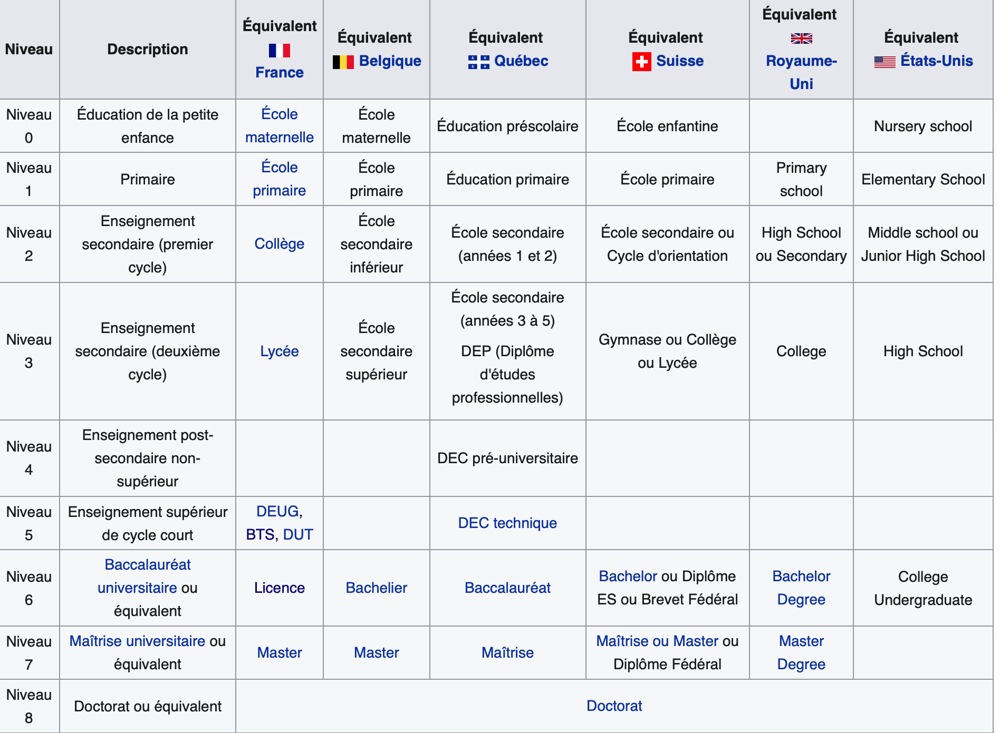

# Système éducatif en France

Enseignement primaire ⟶ enseignement secondaire ⟶ enseignement supérieur.

## Enseignement primaire

**Начальное образование** (фр. enseignement primaire) — 3–4 года в *детском саду* (фр. l'école maternelle) и 5 лет в *начальной школе* (фр. l'école élémentaire).

## Enseignement secondaire

**Среднее образование** (фр. enseignement secondaire) — 4 года в *коллеже* (фр. le collége) и 3 года в *лицее* (фр. le lycée). По окончании выдается диплом бакалавра (фр. baccalauréat или bac) об окончании полного среднего образования, который соответствует уровню 3 по CITE/ISCED.

## Enseignement supérieur

**Высшее образование** (фр. enseignement supérieur) возможно после получения диплома бакалавра об окончании полного среднего образования (фр. baccalauréat или bac).

Типы высшего образования во Франции:

* Короткое высшее образование. Обучение длится два-три года, после которых выпускники получают DUT (diplôme universitaire de technologie) или BTS (brevet de technicien supérieur). Данный вид высшего образования готовит в основном специалистов в сфере промышленности или в сфере обслуживания.

* Длительное высшее образование. Данный вид высшего образования даётся в университетах и высших школах.

Декретом от 2002 года была введена новая система степеней:

* licence (3 года)
* мастер (2 года)
* доктор (3—4 года)

## Lycée

Лицеи подразделяются на три типа: общий, технологический и профессиональный. В первых двух обучение — 3 года. В лицеях общего типа по итогам экзаменов выдаётся общий бакалавриат, дающий право доступа к высшему образованию. По окончании технологического лицея сдаются экзамены на получение технологического бакалавриата — право на обучение в университете по своей специальности. Профессиональные лицеи (подобие российского ПТУ) — обучение 2 года, по окончании которых выдаются свидетельство о профессиональном обучении и сертификат о профессиональной пригодности, не дающие доступа к высшему образованию. Можно получить профессиональный бакалавриат после трёх лет обучения в лицее.

## Classification internationale type de l'éducation

La **classification internationale type de l'éducation** ou **CITE** (**ISCED** pour International Standard Classification of Education) est une classification des différents niveaux d'éducation qui peut s'appliquer pour tous le pays.

