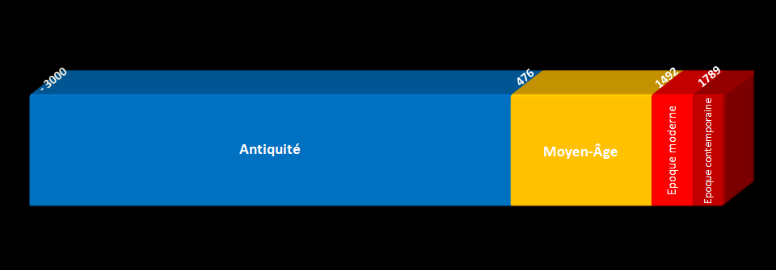

# Периоды истории

Хронологическая схема четырех периодов истории по мнению большинства французских историков:

## Содержание

- [Периоды истории](#периоды-истории)
  - [Содержание](#содержание)
  - [Древний мир](#древний-мир)
  - [Поздняя античность](#поздняя-античность)
  - [Средние века](#средние-века)
  - [Раннее Средневековье](#раннее-средневековье)
  - [Византия](#византия)
  - [Франкское государство](#франкское-государство)
  - [Возрождение](#возрождение)
  - [Новое время](#новое-время)
  - [Новейшее время](#новейшее-время)

## Древний мир

**Древний мир** (англ. **Ancient history**, фр. **l'Antiquité**) — период в истории человечества, выделяемый между доисторическим периодом и началом средних веков в Европе.

## Поздняя античность

**Поздняя античность** — завершающий этап античной цивилизации, период средиземноморской и (также, но в меньшей степени) мировой истории, обычно ограничиваемый III—VI веками н. э.

Распад и падение Западной Римской империи в 476 году и Великое переселение народов (обычно описываемых как «варварские») с окраин континента положили условный конец периоду поздней античности, но не уничтожили её богатого наследия, к которому относится, в первую очередь, распространение и упрочение позиций христианства, но также запечатление памяти (в основном, в многочисленных письменных источниках) об античности эпохи её расцвета. За периодом поздней античности последовали Средние века, а точнее, раннее Средневековье.

## Средние века

**Средние века** или **Средневековье** (англ. **Middle Ages**, фр. **le Moyen Âge**)— период истории Европы и Ближнего Востока, следующий после Античности и предшествующий Новому времени. Историки предлагали разные хронологические рамки для этого периода, основными из которых были 500—1500 и 500—1800.

## Раннее Средневековье

**Раннее Средневековье** — период европейской истории (приблизительно с 476 по 1100 год), начавшийся после падения Западной Римской империи. В эпоху раннего Средневековья произошло Великое переселение народов, появились викинги, возникли королевства остготов в Италии и вестготов в Аквитании и на Пиренейском полуострове и образовалось Франкское государство, в период своего расцвета занимавшее большую часть Западной Европы. Северная Африка и Испания вошли в состав Арабского халифата, на Британских островах существовало множество небольших государств англов, саксов и кельтов, появились государства в Скандинавии, а также в центральной и восточной Европе: Великая Моравия и Киевская Русь.

## Византия

**Византи́я**, **Византи́йская импе́рия**, **Восто́чная Ри́мская импе́рия**, **Греческая империя**, самоназвание **Держава Ромеев**, **Ромейская империя** (англ. **Byzantine Empire**, **Eastern Roman Empire**, **Byzantium**, фр. **l'Empire byzantin ou Empire romain d'Orient**) (395—1453) — государство, сформировавшееся в 395 году вследствие раздела Римской империи на западную и восточную части после смерти императора Феодосия I. В V веке Западная Римская империя прекратила своё существование, оставив Византию единственной исторической, культурной и цивилизационной частью, оставшейся от Древнего Рима и просуществовавшей на протяжении почти тысячелетия истории Поздней Античности и Средневековья.

## Франкское государство

**Фра́нкское государство** (**Королевство фра́нков**, **Фра́нкия**) (англ. **Francia**, **Kingdom of the Franks**, **Frankland**, or **Frankish Empire**, фр. **royaume des Francs**) — государство в Западной и Центральной Европе в V—IX веках, которое образовалось на территории Западной Римской империи одновременно с другими варварскими королевствами. Начиная с III века ядро будущего государства заселялось франками. Вследствие непрерывных военных походов Карла Мартелла, его сына, Пипина Короткого, и внука, Карла Великого, территория государства франков к началу IX века достигла самых больших размеров в период своего существования.

## Возрождение

**Возрожде́ние**, или **Ренесса́нс** (англ. **the Renaissance**, фр. **Renaissance**, итал. Rinascimento от лат. renasci «рождаться опять, возрождаться») — имеющая мировое значение эпоха в истории культуры Европы, пришедшая на смену Средним векам и предшествующая Просвещению и Новому времени. Приходится — в Италии — на начало XIV века (повсеместно в Европе — с XV—XVI веков) — последнюю четверть XVI века и в некоторых случаях — первые десятилетия XVII века. Отличительная черта эпохи Возрождения — светский характер культуры, её гуманизм и антропоцентризм (то есть интерес, в первую очередь, к человеку и его деятельности). Расцветает интерес к античной культуре, происходит её «возрождение» — так и появился термин. Эпоха Возрождения считается точкой отсчета современного европейского искусства, поскольку именно в это время формируется современный характер культуры.

## Новое время

**Но́вое вре́мя**, или **Новая история** (англ. **modern history**, фр. **l'histoire moderne**, **la période moderne** ou **l'ère moderne**) — период в истории человечества, находящийся между Средневековьем и Новейшим временем. Понятие «Новая история» появилось в Италии в эпоху Возрождения, как элемент предложенного гуманистами трехчленного деления истории на древнюю, среднюю и новую. Критерием определения «нового времени», его «новизны» по сравнению с предшествующей эпохой был, с точки зрения гуманистов, расцвет в период Ренессанса светской науки и культуры — то есть не социально-экономический, а духовно-культурный фактор. Однако этот период противоречив по своему содержанию: Высокое Возрождение, Реформация и гуманизм соседствовали со всплеском иррационализма, развитием демонологии, явлением, получившим в литературе наименование «охота на ведьм».

## Новейшее время

**Новейшее время** (**но­вей­шая ис­то­рия**, **со­вре­мен­ная ис­то­рия**) (англ. **Contemporary history**, фр. **l'Époque contemporaine**) — период в истории человечества с 1945 года по настоящее время.
